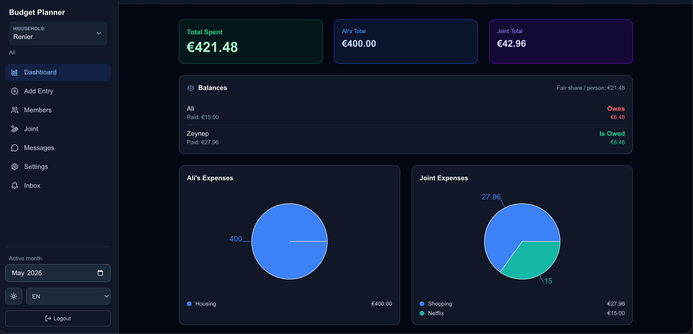
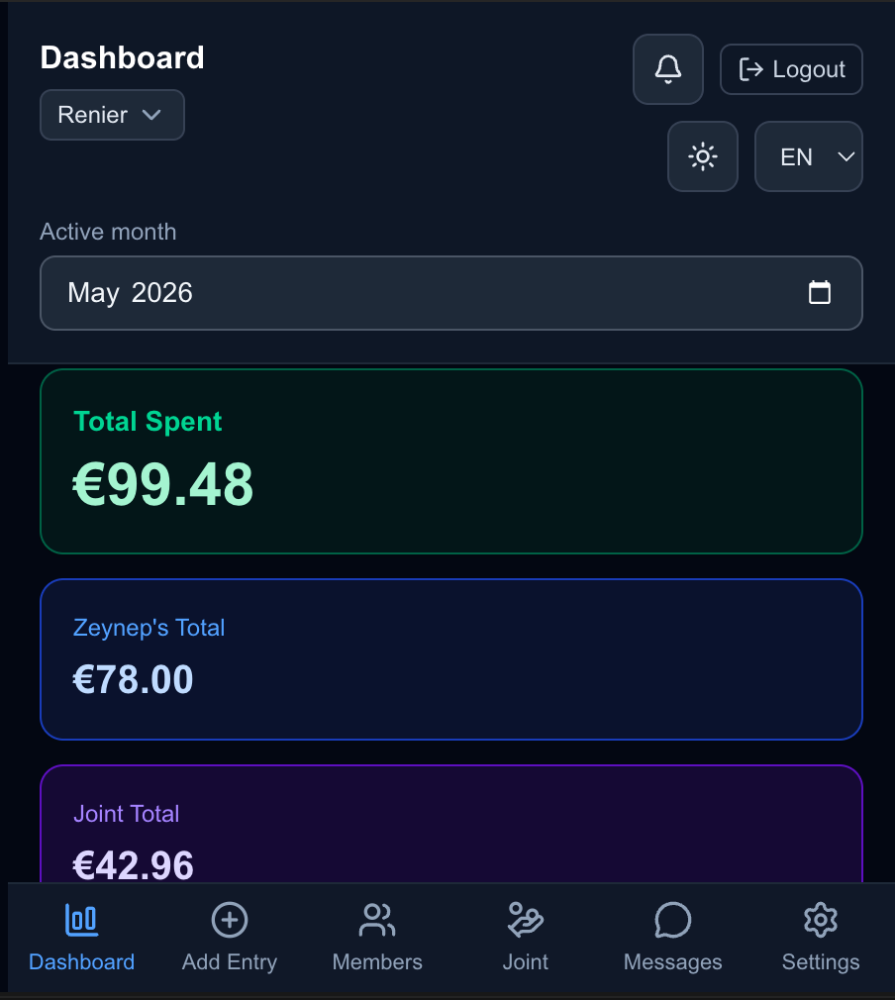
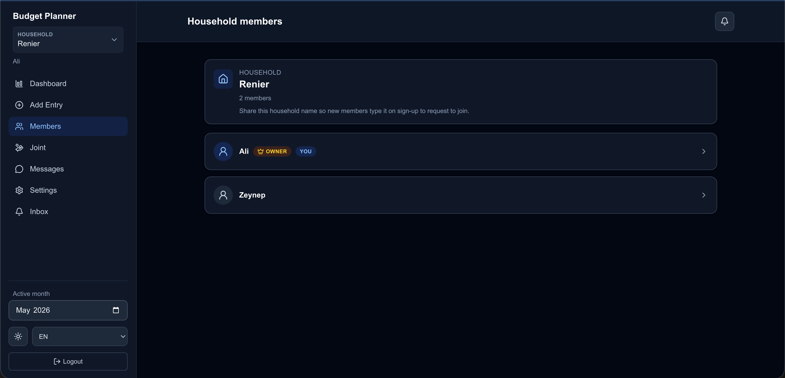
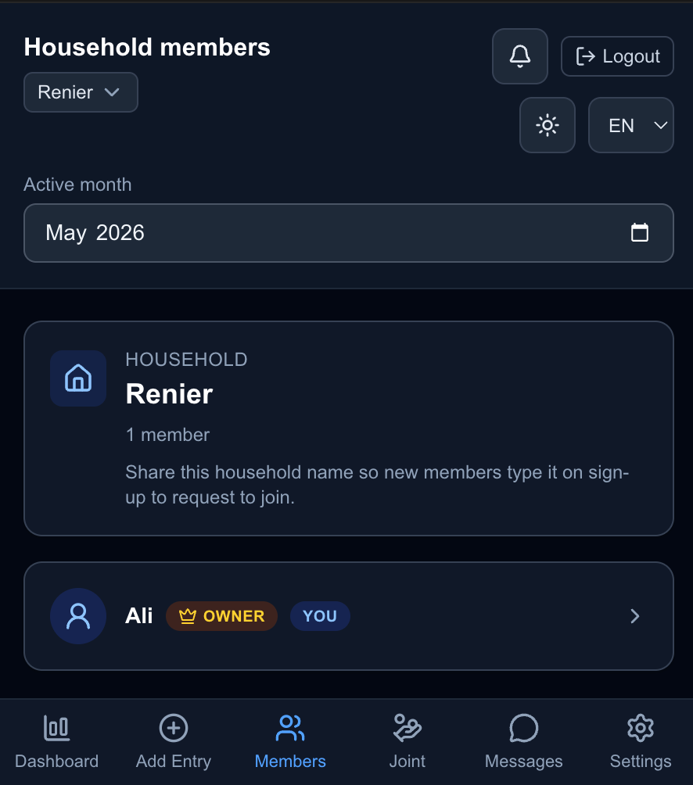

# Budget Planner

[](https://nextjs.org/)
[](https://www.typescriptlang.org/)
[](https://vercel.com/)
[](LICENSE)

A multi-household budget planning web app built with Next.js and Supabase.

This project helps couples, families, and shared households track spending, set budgets, switch between multiple households, and collaborate in one place.

## Why I Built This

I wanted a practical, real-world budgeting app that supports scenarios most simple budget tools miss:
- one user in multiple households
- owner/member permissions
- category + sub-category budgets
- shared and personal spending together

The project was developed iteratively with AI assistance for implementation speed, debugging support, and refactoring help, while product direction, feature priorities, and acceptance decisions were made by me.

## Screenshots

The UI is responsive. Use **`{name}_pc.png`** for desktop and **`{name}.png`** for the same screen on mobile—save PNGs under [`docs/screenshots/`](docs/screenshots/).

### Dashboard

#### Desktop



#### Mobile



### Add expense

#### Desktop


#### Mobile


### Members

#### Desktop



#### Mobile



If an image is missing locally, GitHub will show a broken image until you add that file to `docs/screenshots/`.

## Core Features

- Multi-household support with active household switching
- Role-based access (`owner` / `member`)
- Household creation, join flow, and owner-only household deletion
- Personal + joint expense tracking
- Category and sub-category budgeting
- Over-limit notifications
- Recurring expenses processing
- Month-over-month spending trends
- CSV export
- In-app notifications and household chat
- Internationalization: English, Turkish, Italian
- Light/dark theme support

## Main Expense Categories

The app uses these main categories:

- Housing
- Food
- Transportation
- Utilities
- Shopping
- Entertainment
- Health
- Education
- Investment
- Savings
- Other

## Tech Stack

- [Next.js](https://nextjs.org/) (App Router)
- [React](https://react.dev/)
- [TypeScript](https://www.typescriptlang.org/)
- [Supabase](https://supabase.com/) (Auth, Postgres, RLS)
- [Recharts](https://recharts.org/) for analytics charts
- [lucide-react](https://lucide.dev/) for icons

## Local Development

### 1) Install dependencies

```bash
npm install
```

### 2) Configure environment variables

Create `.env.local`:

```bash
NEXT_PUBLIC_SUPABASE_URL=your_supabase_project_url
NEXT_PUBLIC_SUPABASE_ANON_KEY=your_supabase_anon_key
```

### 3) Initialize database schema

Run the SQL in:

`database_schema.sql`

inside your Supabase SQL editor (or your migration flow).

### 4) Start development server

```bash
npm run dev
```

Open [http://localhost:3000](http://localhost:3000).

## Deploying to Vercel

### 1) Push repository to GitHub

Make sure your latest code is committed and pushed.

### 2) Import project in Vercel

- Go to [Vercel](https://vercel.com/)
- Click **Add New Project**
- Import this GitHub repository

### 3) Configure environment variables in Vercel

Add:

- `NEXT_PUBLIC_SUPABASE_URL`
- `NEXT_PUBLIC_SUPABASE_ANON_KEY`

Use the same values as local `.env.local`.

### 4) Deploy

Trigger the first deployment and wait for build completion.

### 5) Run database schema on production Supabase

Ensure your production Supabase project has the latest `database_schema.sql` applied.

## Security Notes

- Data access is enforced with Supabase Row Level Security (RLS)
- Household boundaries are respected through membership and active-household checks
- Owner-only operations (rename/delete household, join approvals) are enforced in database functions

## Project Status

The app is in active development and continuously improved with new features, UX refinements, and schema hardening.

## Roadmap

Ideas and priorities evolve over time. Current directions include:

- Stronger analytics and household-level reports
- Mobile-first polish and accessibility improvements
- Optional receipt capture flows (exploratory; may be phased)
- Broader i18n coverage for edge-case UI strings

## Contributing

Suggestions and pull requests are welcome. For larger changes, open an issue first so we can align on scope and data model impact (especially anything that touches `database_schema.sql` or Supabase RLS).

**Issues:** use GitHub Issues for bugs, small enhancements, and discussion. Label or describe the affected area (e.g. auth, budgets, multi-household) to make triage easier.
